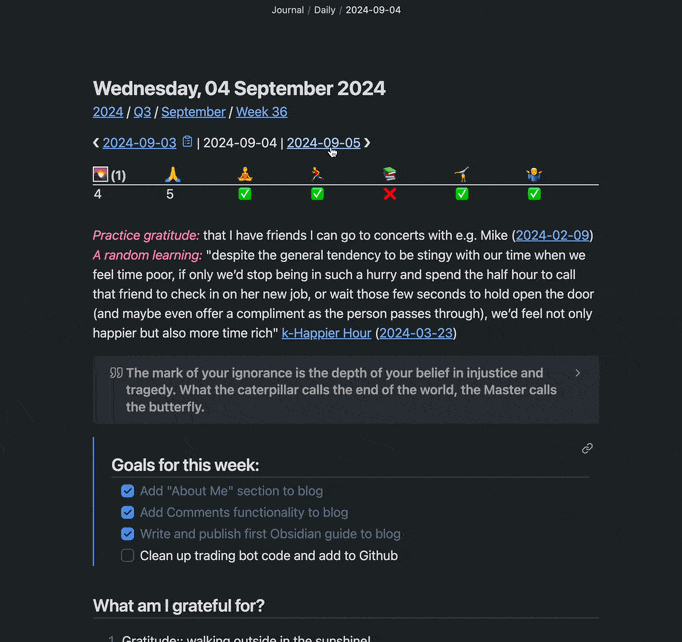

# obsidian-templates
Obsidian templates is a collection of custom journalling templates for Obsidian

# Periodic Notes Navigation

Navigate between **daily**, **weekly**, **monthly**, **quarterly**, and **yearly** notes effortlessly with [Templater](https://github.com/SilentVoid13/Templater).



## Requirement

### Plugins

Install plugins via _Community plugins_ tab.

- [Periodic Notes](https://github.com/liamcain/obsidian-periodic-notes)
- [Templater](https://github.com/SilentVoid13/Templater)
- [Calendar plugin](https://github.com/liamcain/obsidian-calendar-plugin)
- [Dataview](https://github.com/blacksmithgu/obsidian-dataview)
- [Todoist](https://github.com/jamiebrynes7/obsidian-todoist-plugin)

## How to Use

### Setup

1. Copy the templates in `templates/` 
2. Goto _Templater_ settings, enable `Trigger Templater on new file creation`
3. Goto _Periodic Note_ settings, change template settings to use your template files

Alternatively, you can copy the contents to your existing templates.

### Using the template

Clicking on the calender provided by _Calendar plugin_, or run _Periodic Notes_' command will insert the templates automatically:

```
Periodic Notes: Open daily note
Periodic Notes: Open weekly note
Periodic Notes: Open yearly note
Periodic Notes: Open monthly note
Periodic Notes: Open quarterly note
```

### Customization

The template uses **default filenames formats** for periodic notes, if you are using customized filename formats, modify the template accordingly.

| Note      | Filename format |
|-----------|-----------------|
| Daily     | YYYY-MM-DD      |
| Weekly    | gggg-[W]ww      |
| Monthly   | YYYY-MM         |
| Quarterly | YYYY-[Q]Q       |
| Yearly    | YYYY            |

Refer to the [Templater documentation](https://silentvoid13.github.io/Templater/introduction.html) and [Moment.js documentation](https://momentjs.com/docs/) for further customization.

### Using Filename Templates

If you follow links to future notes, _Periodic Notes_ will not get triggered, result in a blank note in your default location.

To fix this, use [Filename Templates](/Filename%20Template/) to insert templates by filename, and put this snippet in front of your periodic templates:

```
<%*
await tp.file.move(`path/to/periodic/notes/${tp.file.title}`);
-%>
```

This snippet will move your periodic notes to the path you specify, and voilà, you can now click through time freely, might as well disable _Periodic Notes_.
